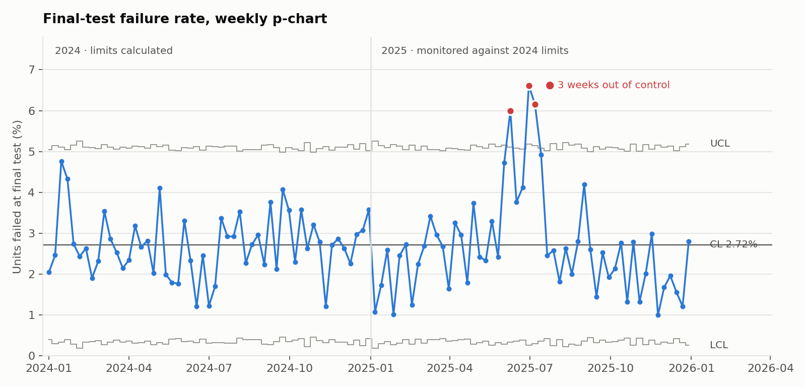
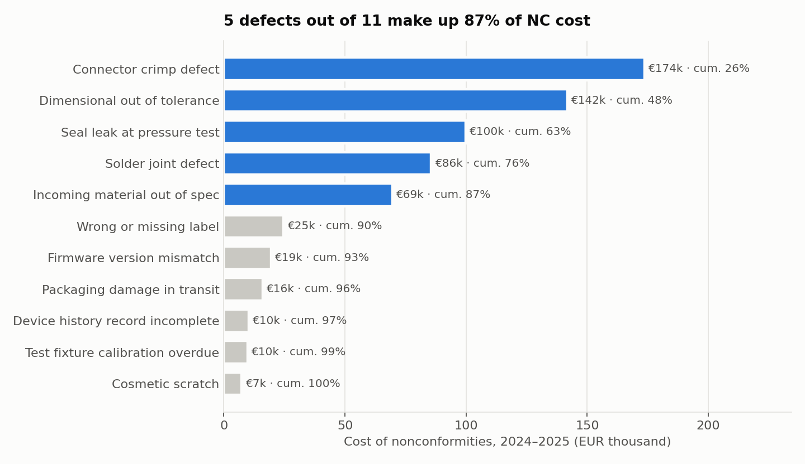
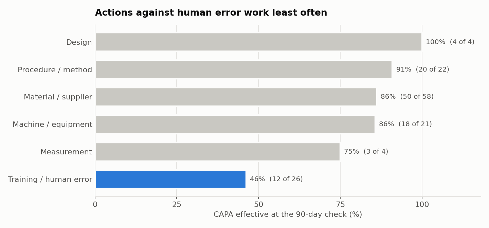
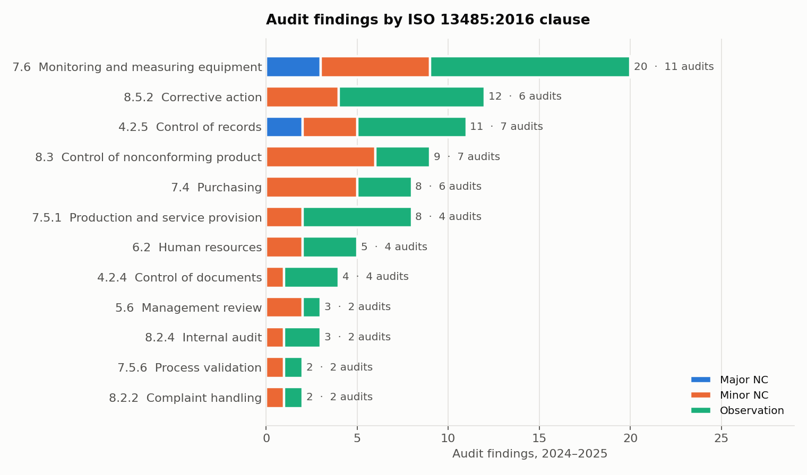

# QMS Analytics: what the quality data says before the auditor does

Analytics for the quality management system of a fictional medical device manufacturer, over two years: nonconformities, CAPA, audit findings and final-test results. The output is the pack a quality manager brings to the management review, with the analysis behind each number.

All data is synthetic, generated by a script in this repository. No real company, product or figure is involved.

**[Open the interactive dashboard](https://mastropasquamatteo.github.io/qms-analytics/)**: KPIs by year, hover on the control chart, switch the Pareto between cost and count.

## Data

| Table | Records | What it holds |
|---|---|---|
| `nonconformities` | 854 | every nonconformity (NC): defect, process, supplier, severity, cost |
| `capa` | 176 | corrective and preventive actions: root cause, due date, closure, 90-day effectiveness check |
| `audit_findings` | 87 | findings from 14 internal, certification and supplier audits, by ISO 13485:2016 clause |
| `inspections` | 105 weeks | units tested and failed at final test |
| `suppliers` | 12 | approved supplier list |

Period: January 2024 to December 2025.

## Key findings

### 1. The yearly KPI said 2025 was fine. It was not.

Final-test failure rate was **2.72% in 2024 and 2.68% in 2025**. On a yearly KPI table, nothing to discuss.

The weekly p-chart tells a different story. Control limits are calculated on 2024 and 2025 is monitored against them. **Three weeks in June and July 2025 are above the upper control limit.**



The cause shows up in the NC data by supplier. Supplier S07 averaged 1–2 NCs per quarter, then raised **24 in Q2 2025 and 14 in Q3**, all connector crimp defects. Over the seven weeks of the problem the failure rate was 5.16%, almost double the baseline. A CAPA quarantined the lot and tightened incoming inspection. From late July the rate went back to 2.18%.

The yearly average hid the problem because the good months before and after diluted it. That is the case for monitoring a process weekly with control limits instead of reading a yearly average.

### 2. Five defects out of eleven make up 87% of NC cost



Connector crimp defects are the most expensive, and about a third of their cost (€56k of €174k) comes from the S07 event alone. Without it, dimensional defects would lead.

Ranking by count instead of cost would give the wrong priorities. Wrong labels, incomplete device history records and cosmetic scratches would rank 4th to 6th, while seal leaks, the third most expensive defect, would drop to 8th.

### 3. CAPA against "human error" work half the time



When the root cause is recorded as training or human error, the action is effective at the 90-day check in **46% of cases (12 of 26)**. For every other root cause the figure is 87%.

A quality professional will recognise the pattern: "operator error, retrain the operator" closes the CAPA on paper but rarely removes the cause. The practical recommendation is to challenge any CAPA with this root cause before approving it, and to ask what in the process allowed the error.

### 4. The audit finding nobody sees in the cost data



Clause **7.6, control of monitoring and measuring equipment, came up in 11 of 14 audits**, with 20 findings and 3 major nonconformities.

In the cost Pareto the matching defect, *test fixture calibration overdue*, is near the bottom: 29 NCs, about €10k. Cheap to fix, and a systemic weakness at the same time. A cost Pareto measures money, not regulatory risk. Both views are needed.

Clause 8.5.2, corrective action, is the second most frequent (12 findings in 6 audits, 3 still open). It matches the CAPA data: only 61% of closed CAPA were closed on time.

## Management review KPIs

| KPI | 2024 | 2025 |
|---|---|---|
| Nonconformities raised | 413 | 441 |
| Cost of nonconformities (EUR) | 314,589 | 342,993 |
| Major + critical NC | 119 | 138 |
| Final test failure rate (%) | 2.72 | 2.68 |
| CAPA opened | 82 | 94 |
| CAPA closed on time (% of closed) | 57.3 | 65.4 |
| CAPA median days to close | 47 | 51 |
| CAPA effective at 90-day check (%) | 80.5 | 77.4 |
| CAPA open and overdue at year end | | 6 |
| Audit findings (all types) | 46 | 41 |
| Audit major nonconformities | 3 | 2 |

CAPA figures are by year opened. For 2025, the actions opened late in the year are still open or waiting for the effectiveness check, so the 2025 CAPA figures will move.

Full pack: [`output/management_review.md`](output/management_review.md).

## Approach

The KPIs are SQL on SQLite. Python loads the files, calculates the control chart and draws the charts.

| Step | File | What it does |
|---|---|---|
| Parameters | `sql/00_params.sql` | reporting date: anything open after it counts as open |
| NC volume | `sql/01_nonconformities.sql` | NCs per month, and per supplier and quarter |
| Pareto | `sql/02_pareto.sql` | cost per defect with cumulative share (window functions) |
| CAPA | `sql/03_capa.sql` | days to close, on time or late, overdue, effectiveness by root cause |
| Audits | `sql/04_audits.sql` | findings by clause; clauses raised in 5 or more of the 14 audits |
| Review pack | `sql/05_management_review.sql` | the KPI table, 2024 vs 2025, including a median computed in SQL |
| Control chart | `analysis.py` | p-chart with limits from 2024, variable by week because units tested vary |

**Control chart rules.** A week is flagged when the failure rate is outside the 3-sigma limits, or when 8 consecutive weeks fall on the same side of the centre line (a sustained shift). The limits come from 2024 only, so 2025 is judged against a baseline it did not influence.

## Limits

- **The improvement after the fix is not yet proven.** From August to December 2025 the failure rate (2.18%) is below the 2024 centre line, but it has not produced 8 consecutive weeks below it. On this data, "back to normal" is supported; "better than before" is not yet.
- **One story, planted on purpose.** The supplier event was built into the generator so the analysis has something real to find. The other patterns (training CAPA, clause 7.6) are also set in the generator's parameters. The value of the project is in how they are found and presented, not in the patterns themselves.
- **Effectiveness is a yes/no field.** In a real QMS it would be better measured by recurrence: the same defect coming back on the same process after the CAPA was closed.
- **SQLite, not SQL Server.** The logic is standard SQL. Date functions (`julianday`, `substr` on dates) would change in T-SQL.

## Run it

```bash
pip install -r requirements.txt
python generate_data.py   # writes data/*.csv
python analysis.py        # writes output/ and charts/
python build_dashboard.py # writes index.html, the interactive dashboard
```

The generator uses a fixed seed, so the numbers above are reproducible.

## Repository structure

```
generate_data.py     synthetic QMS data
analysis.py          loads data, runs the SQL, control chart, charts
build_dashboard.py   builds index.html (the dashboard) from data/
index.html           interactive dashboard, published with GitHub Pages
sql/                 KPI logic, run in file order
data/                generated source tables
output/              KPI tables and the management review pack
charts/              charts used in this README
```

## Stack

SQL (SQLite), Python, pandas, NumPy, matplotlib, JavaScript (dashboard, no libraries). Statistical process control (p-chart), Pareto analysis, ISO 13485:2016.
